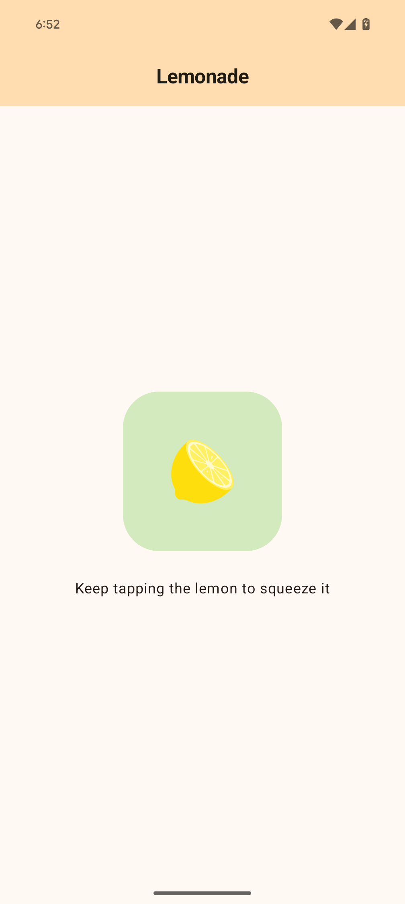

# Lemonade

Create lemonade by tapping a lemon tree, squeezing lemons, and enjoying your drink in this fun, interactive app!

## Features

- [x] Users tap on the image of the lemon tree to pick a lemon.
- [ ] Users tap on the lemon image, achieving a randomly determined number of taps (between 2 to 4) to make lemonade.
- [ ] Users tap on the glass of completed lemonade to perform the action of drinking.
- [ ] Users tap on the empty glass to return to the initial lemon tree screen and enjoy making lemonade again.

## Screenshot



## Getting Started

1. Clone the repository ```sh git clone https://github.com/uitangclan/lemonade.git```
2. Open the project in Android Studio
3. Build and run the app on an emulator or a device

## Built With

- [Kotlin](https://kotlinlang.org/) - Programming language
- [Jetpack Compose](https://developer.android.com/jetpack/compose) - UI toolkit

## Authors

- **Yuji RZA** - [uitangclan](https://github.com/uitangclan)

## License

This project is licensed under the MIT License - see the [LICENSE.md](LICENSE) file for details

## Acknowledgments

- Inspired by the [Google Codelab on Android Basics with Compose](https://developer.android.com/courses/android-basics-compose/course)
